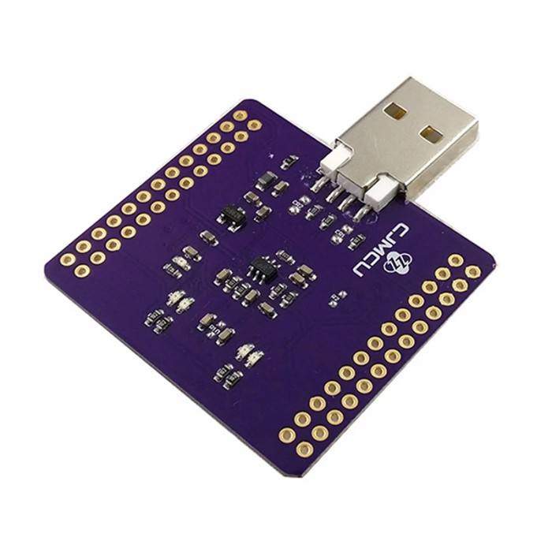

# FTDI FT2232HL Support for Arduino Emulator

This directory contains the implementation for FTDI FT2232HL support in the Arduino Emulator, providing GPIO, SPI, and I2C functionality through USB.



## Overview

The FTDI FT2232HL is a dual-channel USB-to-UART/SPI/I2C converter that provides:
- **Dual independent channels** (Channel A and Channel B)
- **MPSSE mode** for high-speed serial protocols (SPI, I2C)
- **Bitbang mode** for GPIO operations
- **16 GPIO pins** (8 per channel: ADBUS0-7, BDBUS0-7)

## Hardware Requirements

### FTDI FT2232HL Device
- USB connection to host computer
- External pull-up resistors for I2C (typically 4.7kΩ on SCL and SDA lines)

### Pin Mapping

#### Channel A (Pins 0-7)
- **GPIO Mode**: ADBUS0-ADBUS7 available as digital I/O
- **SPI Mode**: 
  - ADBUS0: SCK (Clock)
  - ADBUS1: MOSI (Master Out, Slave In)  
  - ADBUS2: MISO (Master In, Slave Out)
  - ADBUS3-7: Available for CS or other GPIO
- **I2C Mode**:
  - ADBUS0: SCL (Clock) - requires 4.7kΩ pull-up
  - ADBUS1: SDA_OUT (Data Out)
  - ADBUS2: SDA_IN (Data In) - requires 4.7kΩ pull-up
  - ADBUS3-7: Available for other functions

#### Channel B (Pins 8-15)
- **GPIO Mode**: BDBUS0-BDBUS7 available as digital I/O
- Similar protocol support as Channel A

## Software Requirements

### Dependencies
- **libftdi1**: FTDI device communication library  
- **pkg-config**: For finding libftdi1 (Linux/macOS)
- **FTDI D2XX drivers**: Alternative high-performance drivers (optional)

## Driver and Library Installation

### Linux (Ubuntu/Debian)

#### Method 1: Using Package Manager (Recommended)
```bash
# Install libftdi1 development library and pkg-config
sudo apt-get update
sudo apt-get install libftdi1-dev pkg-config

# Verify installation
pkg-config --libs libftdi1
# Should output: -lftdi1
```

#### Method 2: Build from Source
```bash
# Install dependencies
sudo apt-get install cmake build-essential libusb-1.0-0-dev

# Clone and build libftdi
git clone https://github.com/libftdi/libftdi.git
cd libftdi
mkdir build && cd build
cmake ..
make
sudo make install
sudo ldconfig
```

#### Permissions Setup (Important!)
```bash
# Create udev rule for FTDI devices (prevents need for sudo)
sudo tee /etc/udev/rules.d/99-ftdi.rules << EOF
# FTDI FT232/FT2232 devices
SUBSYSTEM=="usb", ATTRS{idVendor}=="0403", ATTRS{idProduct}=="6001", MODE="0666", GROUP="dialout"
SUBSYSTEM=="usb", ATTRS{idVendor}=="0403", ATTRS{idProduct}=="6010", MODE="0666", GROUP="dialout"
SUBSYSTEM=="usb", ATTRS{idVendor}=="0403", ATTRS{idProduct}=="6011", MODE="0666", GROUP="dialout"
SUBSYSTEM=="usb", ATTRS{idVendor}=="0403", ATTRS{idProduct}=="6014", MODE="0666", GROUP="dialout"
EOF

# Add your user to dialout group
sudo usermod -a -G dialout $USER

# Reload udev rules and restart
sudo udevadm control --reload-rules
sudo udevadm trigger
# Log out and back in, or restart system
```

### Linux (Fedora/CentOS/RHEL)
```bash
# Install development libraries
sudo dnf install libftdi1-devel pkgconfig

# Or on older versions:
sudo yum install libftdi1-devel pkgconfig

# Set up permissions (same udev rules as above)
```

### Linux (Arch Linux)
```bash
# Install from official repository
sudo pacman -S libftdi pkg-config

# Install from AUR for latest version
yay -S libftdi-git
```

### macOS

#### Method 1: Using Homebrew (Recommended)
```bash
# Install Homebrew if not already installed
/bin/bash -c "$(curl -fsSL https://raw.githubusercontent.com/Homebrew/install/HEAD/install.sh)"

# Install libftdi
brew install libftdi pkg-config

# Verify installation
pkg-config --libs libftdi1
```

#### Method 2: Using MacPorts
```bash
# Install MacPorts, then:
sudo port install libftdi1 +universal
```

#### Method 3: Build from Source
```bash
# Install dependencies
brew install cmake libusb pkg-config

# Clone and build
git clone https://github.com/libftdi/libftdi.git
cd libftdi
mkdir build && cd build
cmake .. -DCMAKE_INSTALL_PREFIX=/usr/local
make
sudo make install
```

### Windows

#### Method 1: Using vcpkg (Recommended for Development)
```bash
# Install vcpkg
git clone https://github.com/Microsoft/vcpkg.git
cd vcpkg
.\bootstrap-vcpkg.bat

# Install libftdi1
.\vcpkg install libftdi1:x64-windows
# Or for 32-bit: .\vcpkg install libftdi1:x86-windows

# Integrate with Visual Studio
.\vcpkg integrate install
```

#### Method 2: Pre-built Libraries
1. **Download FTDI D2XX drivers**:
   - Go to [FTDI website](https://ftdichip.com/drivers/d2xx-drivers/)
   - Download "D2XX Direct Drivers" for Windows
   - Install the driver package

2. **Download libftdi1 binaries**:
   - Download from [libftdi releases](https://github.com/libftdi/libftdi/releases)
   - Extract to `C:\libftdi1\`
   - Add `C:\libftdi1\bin` to PATH

#### Method 3: MSYS2/MinGW
```bash
# In MSYS2 terminal
pacman -S mingw-w64-x86_64-libftdi mingw-w64-x86_64-pkg-config
```

#### Windows Driver Notes
- **Windows 10/11**: Drivers are usually installed automatically
- **Older Windows**: May need manual driver installation from FTDI website
- **Driver conflicts**: If device doesn't work, check Windows Device Manager
- **Virtual Serial Port**: Windows may create COM ports - disable if using direct FTDI access

### Verification Steps

#### Test FTDI Device Detection
```bash
# Linux/macOS: List USB devices
lsusb | grep -i ftdi
# Should show something like: "Bus 001 Device 005: ID 0403:6010 Future Technology Devices International, Ltd FT2232C/D/H Dual UART/FIFO IC"

# Check device permissions (Linux)
ls -l /dev/bus/usb/001/005  # Use actual bus/device numbers
# Should show readable/writable permissions for your user

# Test with libftdi tools (if available)
ftdi_eeprom --help
```

#### Test Library Installation
```cpp
// Simple test program
#include <ftdi.h>
#include <iostream>

int main() {
    struct ftdi_context *ftdi = ftdi_new();
    if (!ftdi) {
        std::cout << "Failed to create FTDI context" << std::endl;
        return -1;
    }
    
    // Try to open first FTDI device
    int ret = ftdi_usb_open(ftdi, 0x0403, 0x6010);
    if (ret == 0) {
        std::cout << "FTDI device opened successfully!" << std::endl;
        ftdi_usb_close(ftdi);
    } else {
        std::cout << "Failed to open FTDI device: " << ftdi_get_error_string(ftdi) << std::endl;
    }
    
    ftdi_free(ftdi);
    return 0;
}
```

```bash
# Compile test (Linux/macOS)
g++ test_ftdi.cpp -lftdi1 -o test_ftdi
./test_ftdi
```

## Building with FTDI Support

### CMake Configuration
```bash
# Enable FTDI support during configuration
cmake -B build -S . -DUSE_FTDI=ON

# Optional: Also enable other features
cmake -B build -S . -DUSE_FTDI=ON -DUSE_RPI=ON

# Build the project
cmake --build build
```

### Example Sketch CMakeLists.txt
```cmake
cmake_minimum_required(VERSION 3.11...3.19)

# Simple FTDI sketch
arduino_sketch(my_ftdi_project main.ino)

# FTDI sketch with additional libraries  
arduino_sketch(sensor_project sensor.ino LIBRARIES MySensorLib)
```

## Usage Examples

### Basic Setup
```cpp
#include "Arduino.h"

#ifdef USE_FTDI
#include "HardwareSetupFTDI.h"
#endif

void setup() {
  Serial.begin(115200);
  
#ifdef USE_FTDI
  // Initialize FTDI with default parameters (VID:0x0403, PID:0x6010)
  if (FTDI.begin()) {
    Serial.println("FTDI initialized successfully");
  } else {
    Serial.println("FTDI initialization failed");
  }
#endif
}
```

### GPIO Operations
```cpp
void setup() {
  // Configure pins
  pinMode(0, OUTPUT);    // ADBUS0 as output
  pinMode(1, INPUT);     // ADBUS1 as input
  pinMode(8, OUTPUT);    // BDBUS0 as output (Channel B)
}

void loop() {
  // Digital write/read
  digitalWrite(0, HIGH);
  int state = digitalRead(1);
  
  // Channel B GPIO
  digitalWrite(8, !digitalRead(8)); // Toggle pin 8
  
  delay(1000);
}
```

### SPI Communication
```cpp
#include <SPI.h>

void setup() {
  SPI.begin();
  pinMode(3, OUTPUT); // Use ADBUS3 as chip select
  digitalWrite(3, HIGH);
}

void loop() {
  digitalWrite(3, LOW);  // Select device
  
  SPI.beginTransaction(SPISettings(1000000, MSBFIRST, SPI_MODE0));
  uint8_t response = SPI.transfer(0x42);
  SPI.endTransaction();
  
  digitalWrite(3, HIGH); // Deselect device
  
  Serial.print("SPI Response: 0x");
  Serial.println(response, HEX);
  delay(1000);
}
```

### I2C Communication  
```cpp
#include <Wire.h>

void setup() {
  Wire.begin();
  Wire.setClock(100000); // 100kHz
}

void loop() {
  // Write to I2C device at address 0x48
  Wire.beginTransmission(0x48);
  Wire.write(0x01); // Register address
  Wire.write(0xAB); // Data
  uint8_t error = Wire.endTransmission();
  
  if (error == 0) {
    Serial.println("I2C write successful");
  }
  
  // Read from I2C device
  Wire.requestFrom(0x48, 1);
  if (Wire.available()) {
    uint8_t data = Wire.read();
    Serial.print("I2C data: 0x");
    Serial.println(data, HEX);
  }
  
  delay(1000);
}
```

### Device Selection
```cpp
void setup() {
  // Select specific FTDI device by VID/PID
  FTDI.setDeviceParams(0x0403, 0x6010);
  
  // Or by description/serial
  FTDI.setDeviceParams(0x0403, 0x6010, "My FTDI Device", "FT123456");
  
  if (FTDI.begin()) {
    Serial.println("Specific FTDI device found");
  }
}
```

## API Reference

### HardwareSetupFTDI Class
```cpp
class HardwareSetupFTDI {
public:
  bool begin(bool asDefault = true);
  void end();
  void setDeviceParams(int vendor_id, int product_id, 
                      const char* description = nullptr, 
                      const char* serial = nullptr);
  
  HardwareGPIO_FTDI* getGPIO();
  HardwareI2C_FTDI* getI2C();
  HardwareSPI_FTDI* getSPI();
};

// Global instance
extern HardwareSetupFTDI FTDI;
```

### Supported Arduino Functions
- **GPIO**: `pinMode()`, `digitalWrite()`, `digitalRead()`
- **SPI**: Full SPI library compatibility
- **I2C**: Full Wire library compatibility

### Limitations
- No analog I/O (analogRead/analogWrite) - FT2232HL is digital only
- No PWM support - use external PWM controller if needed
- No tone generation - use external buzzer controller
- No pulse measurement functions - would require custom implementation

## Troubleshooting

### Common Issues

#### 1. "Failed to open FTDI device"
- Check USB connection
- Verify device permissions (`sudo` or udev rules)
- Ensure correct VID/PID values

#### 2. "libftdi1 not found"
- Install libftdi1-dev package
- Check pkg-config can find libftdi1: `pkg-config --libs libftdi1`

#### 3. I2C Communication Fails
- Verify pull-up resistors on SCL and SDA (typically 4.7kΩ)
- Check device address (7-bit vs 8-bit addressing)
- Ensure proper connections

#### 4. SPI Issues
- Verify wiring: SCK, MOSI, MISO connections
- Check SPI mode and clock settings
- Ensure proper chip select timing

## Cross-Platform Build Instructions

### Linux Build
```bash
# After installing dependencies above
cmake -B build -S . -DUSE_FTDI=ON
cmake --build build

# Run example
./build/examples/ftdi-test/ftdi-test
```

### macOS Build  
```bash
# Same as Linux after installing via Homebrew
cmake -B build -S . -DUSE_FTDI=ON
cmake --build build
```

### Windows Build (Visual Studio)
```bash
# Using vcpkg toolchain
cmake -B build -S . -DUSE_FTDI=ON -DCMAKE_TOOLCHAIN_FILE=C:/vcpkg/scripts/buildsystems/vcpkg.cmake
cmake --build build --config Release

# Or open in Visual Studio and build
```

### Windows Build (MSYS2/MinGW)
```bash
# In MSYS2 MinGW64 terminal
cmake -B build -S . -DUSE_FTDI=ON -G "MinGW Makefiles"
cmake --build build
```

## Common Installation Issues

### Linux Issues
- **Permission denied**: Check udev rules and user groups
- **Library not found**: Run `sudo ldconfig` after installation
- **CMake can't find libftdi1**: Install `pkg-config` package

### macOS Issues  
- **Homebrew not found**: Install Homebrew first
- **Library architecture mismatch**: Use `brew install libftdi --universal`
- **Permission issues**: Usually not needed on macOS

### Windows Issues
- **Driver not installed**: Install FTDI D2XX drivers from FTDI website
- **Library not found**: Ensure libftdi1 DLLs are in PATH
- **COM port conflicts**: Disable VCP drivers in Windows Device Manager if using direct access

### Debug Output
Enable debug logging:
```cpp
void setup() {
  Serial.begin(115200);
  Logger.setLevel(LogLevel::Debug); // Enable debug messages
}
```

## Performance Notes

- **GPIO**: Suitable for moderate-speed digital I/O
- **SPI**: Up to ~10MHz clock speeds supported
- **I2C**: Standard (100kHz) and Fast (400kHz) modes supported
- **Latency**: USB communication introduces some latency compared to native hardware

## Examples

See the `examples/ftdi-test/` directory for a complete working example that demonstrates GPIO, SPI, and I2C functionality with the FTDI FT2232HL.